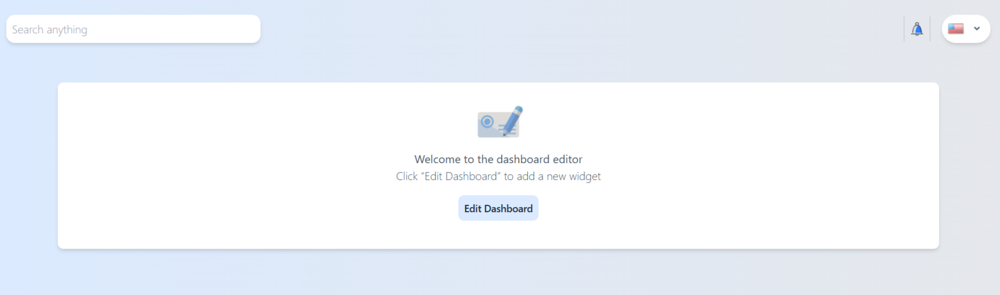
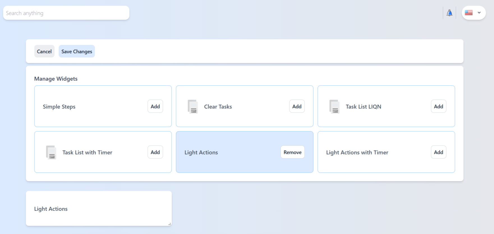

# 🛠️ React Dashboard с виджетами

  
  

## 🔥 Особенности

###️ Ядро системы
- Динамическое добавление/удаление виджетов
- Drag-and-drop интерфейс через react-grid-layout
- Сохранение состояния в localStorage
- 2 режима работы: просмотр и редактирование

## 🚀 Быстрый старт
# 1. Установка
git clone https://github.com/yourskynas/Dashboard.git
cd dashboard-app

# 2. Зависимости
npm install

# 3. Запуск
npm run dev

| Команда           | Действие                     |
|-------------------|-----------------------------|
| npm run dev     | Запуск dev-сервера         |
| npm run build   | Production сборка          |
| npm run preview | Локальный просмотр сборки |

## 🌐 Демо-версия

Доступна по адресу:  
[https://yourskynas.github.io/Dashboard/](https://yourskynas.github.io/Dashboard/)

> 🔑 Секретное слово: LIQN (найдите в интерфейсе)

## 📚 Технологии

| Технология       | Назначение                  |
|------------------|----------------------------|
| React 19         | Базовый фреймворк          |
| Vite             | Сборка проекта             |
| Tailwind CSS     | Стилизация                 |
| React Grid Layout| Drag-and-drop функционал   |

> 💡 Проект создан в рамках тестового задания
